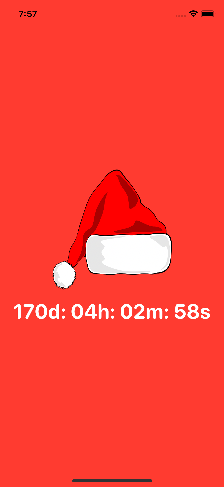

# Christmas Countdown
Christmas (or Feast of the Nativity) is an annual festival commemorating the birth of Jesus Christ, observed primarily on December 25 as a religious and cultural celebration among billions of people around the world. A feast central to the Christian liturgical year, it is preceded by the season of Advent or the Nativity Fast and initiates the season of Christmastide, which historically in the West lasts twelve days and culminates on Twelfth Night; in some traditions, Christmastide includes an octave. Christmas Day is a public holiday in many of the world's nations, is celebrated religiously by a majority of Christians, as well as culturally by many non-Christians, and forms an integral part of the holiday season centered around it.

# App Preview

